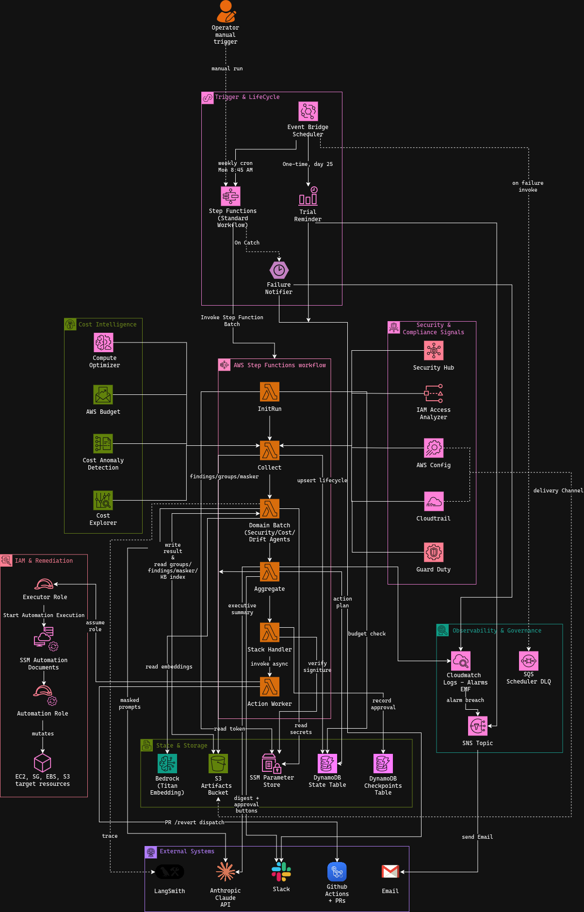
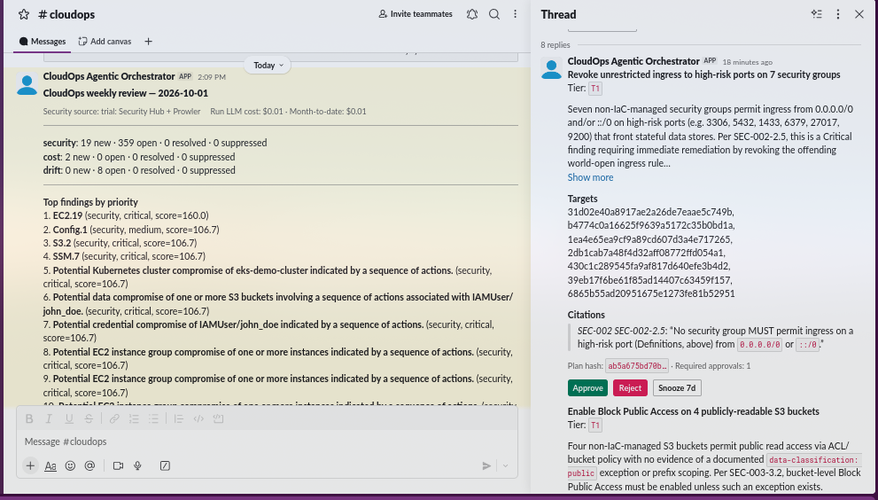
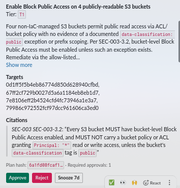
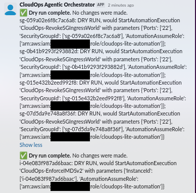
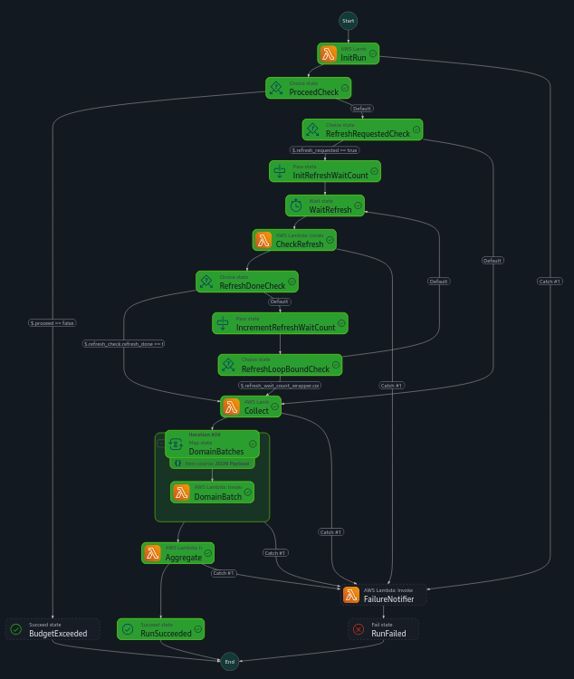
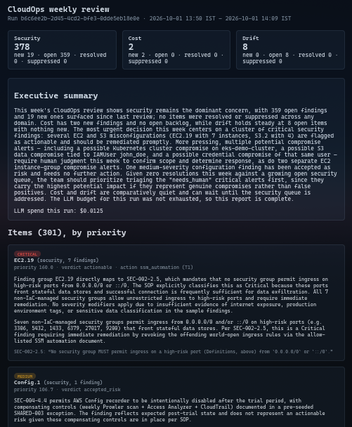
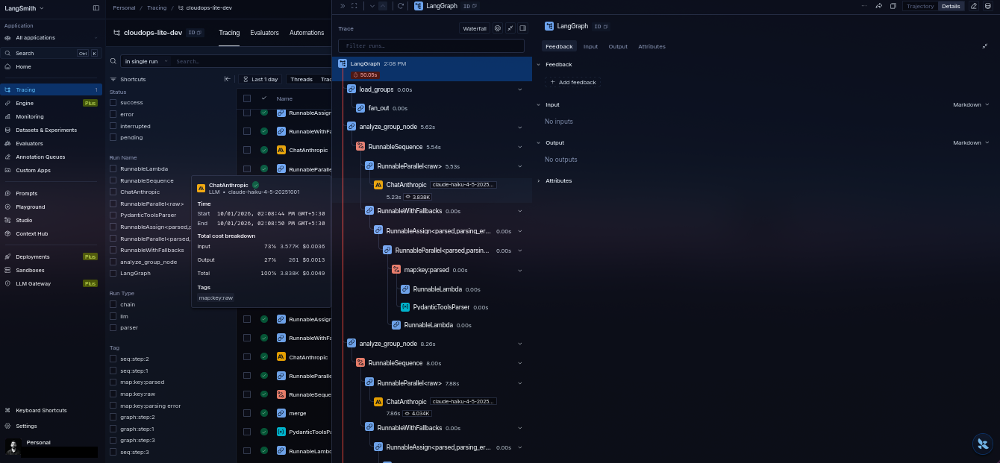
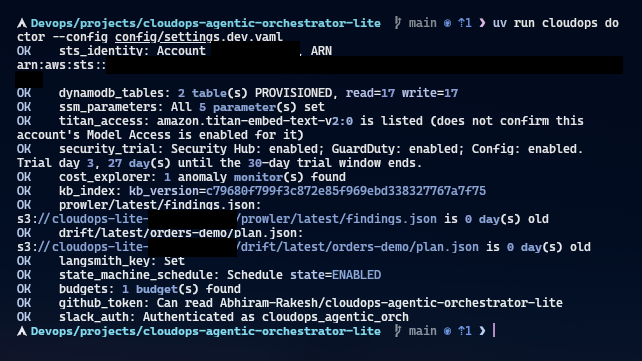
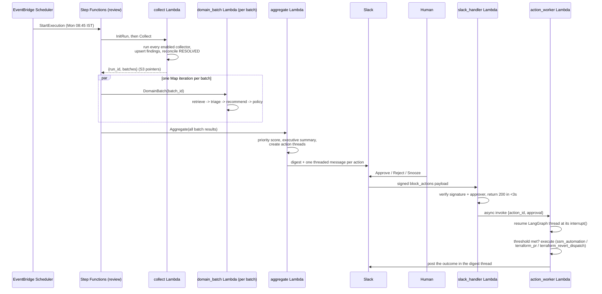

# CloudOps Agentic Orchestrator

A multi-agent CloudOps system on AWS. **Security**, **Cost** and **Drift** agents (LangGraph, running inside AWS Lambda and orchestrated by AWS Step Functions) replace the weekly "open three dashboards and triage" ritual with one report that is grounded in your written SOPs. Every finding is reasoned about against a retrieved SOP clause, cited verbatim, and scored deterministically. Remediation only happens **after a human clicks Approve in Slack** against a hash-pinned plan, and it runs through the same narrow paths a human would use: a Terraform PR, an allow-listed SSM Automation document, or a ticket.

The LLM never holds write credentials. It produces a structured `Recommendation`; a deterministic policy engine decides, in code, whether and how anything can run.

> **Status:** deployed on AWS and verified end to end: a real weekly review across all three domains, the Slack approval flow through to an SSM Automation dry-run dispatch, Terraform PR drafting, drift detection against the demo stack, and LangSmith tracing.

---

## Contents

- [Architecture diagram](#architecture-diagram)
- [Screenshots](#screenshots)
- [Tech stack](#tech-stack)
- [How it works](#how-it-works)
- [Prerequisites](#prerequisites)
- [Deployment: step by step](#deployment--step-by-step)
- [Running the demo](#running-the-demo)
- [Configuration reference](#configuration-reference)
- [Observability](#observability)
- [AWS cost estimate](#aws-cost-estimate)
- [Day-2 operations](#day-2-operations)
- [Troubleshooting](#troubleshooting)
- [Teardown](#teardown)
- [Security](#security)
- [Repository layout](#repository-layout)
- [Design decisions](#design-decisions)
- [License](#license)

---

## Architecture diagram



How to read it:

- **Trigger and lifecycle (top).** EventBridge Scheduler starts the Step Functions Standard state machine every Monday 08:45 IST. An operator can start it by hand. A second one-time schedule fires the trial reminder on day 25 of the security-services trial. Any failure routes to the Failure Notifier, which posts to Slack.
- **Step Functions workflow (centre).** `InitRun` → `Collect` → `DomainBatch` (one Map iteration per batch of finding groups: Security, Cost, Drift) → `Aggregate`. Payloads between states are S3 pointers and IDs, never full finding lists.
- **Signals (left and right).** Collectors read Security Hub, IAM Access Analyzer, AWS Config, CloudTrail, GuardDuty, Compute Optimizer, Budgets, Cost Anomaly Detection and Cost Explorer. Prowler and `terraform plan -refresh-only` run in GitHub Actions and publish artifacts to S3.
- **State and storage.** DynamoDB single-table state, a DynamoDB checkpoints table (LangGraph), an S3 artifacts bucket (evidence, reports, KB index), SSM Parameter Store for secrets, and Bedrock Titan for the knowledge-base embeddings.
- **Human in the loop.** `Aggregate` posts the digest and one threaded approval message per automatable action to Slack. A click goes to the `slack_handler` Lambda Function URL (HMAC-verified), which records the approval and asynchronously invokes `action_worker`. That Lambda resumes the paused LangGraph thread and executes through exactly one of three paths: an SSM Automation document (via an assumed `executor` role), a Terraform PR, or a `workflow_dispatch` revert.
- **External systems (bottom).** Anthropic Claude API, LangSmith traces, Slack, GitHub Actions and PRs, and email (SNS) for alarms.

---

## Screenshots

All taken from a real deployment against the demo stack. The GuardDuty entries ("Potential Kubernetes cluster compromise" and similar) are seeded sample findings.

### Weekly digest in Slack



The weekly review posted to `#cloudops`: counts per domain, the top findings ranked by priority, and a threaded approval card for each action that can be automated.

### Approval card



One action awaiting a decision: its risk tier, the targets, the SOP clause it cites verbatim, the plan hash the approval is bound to, and the Approve / Reject / Snooze buttons.

### Outcome after approval



After an approval the buttons are cleared and the result is posted in the thread. These are dry-run SSM Automation actions, so each reply lists what *would* have run per target; nothing in AWS was changed.

### Step Functions execution



A succeeded weekly run: `InitRun`, the optional Prowler/drift refresh wait, `Collect`, the `DomainBatches` map and `Aggregate`. The failure-notifier path was not taken.

### HTML report



The report written to S3 and linked from the digest: an executive summary and the findings ranked by priority score, each with its verdict, proposed action and cited SOP clause.

### LangSmith trace



One domain-agent run: the graph fans out per finding group, and each group is triaged by Claude Haiku 4.5. Prompts and responses are hidden by `langsmith.anonymize`, so only the structure, latency and token counts show.

### `cloudops doctor`



Read-only health checks against the deployed account, all passing. Account identifiers are redacted.

> The digest and report screenshots were captured on a run made before the LLM cost accounting was fixed, so their cost lines understate that run's real cost (about $3.36). See [AWS cost estimate](#aws-cost-estimate).

---

## Tech stack

| Layer              | Technology                                              | Purpose                                                                            |
| ------------------ | ------------------------------------------------------- | ---------------------------------------------------------------------------------- |
| Orchestration      | AWS Step Functions (Standard)                           | Weekly pipeline: init, collect, per-domain Map, aggregate                          |
| Compute            | AWS Lambda (Python 3.12, arm64, zip, no VPC)            | Eight functions: `init_run`, `collect`, `domain_batch`, `aggregate`, `action_worker`, `slack_handler`, `failure_notifier`, `trial_reminder` |
| Agents             | LangGraph                                               | Per-group domain graph; long-lived, checkpointed action (approval) graph           |
| LLM                | Anthropic Claude via `langchain-anthropic`              | Triage on Haiku 4.5, reasoning on Sonnet 5; masked prompts; hard cost caps         |
| Embeddings         | Amazon Bedrock, Titan Text Embeddings V2 (1024-d)       | SOP knowledge-base retrieval (hybrid with BM25 and control-ID matching)            |
| State              | DynamoDB (provisioned), single-table + checkpoints      | Findings, action plans, approvals, locks, exceptions, audit log, LLM spend         |
| Artifacts          | S3                                                      | Evidence, reports, KB index, Prowler and drift artifacts                           |
| Secrets            | SSM Parameter Store (SecureString)                      | Anthropic, LangSmith, Slack and GitHub credentials, read at Lambda cold start      |
| Security signals   | Security Hub, GuardDuty, Config, IAM Access Analyzer, CloudTrail, Prowler | Findings (Security Hub/GuardDuty/Config during the ~30-day trial; Prowler and Access Analyzer after) |
| Cost signals       | Cost Anomaly Detection, Cost Explorer, Compute Optimizer, deterministic waste checks | Cost findings                                                |
| Drift              | `terraform plan -refresh-only` in GitHub Actions + CloudTrail | Drift findings with actor attribution                                        |
| Approvals          | Slack interactive messages + Lambda Function URL        | Human approval, HMAC-verified in code                                              |
| Remediation        | SSM Automation (7 allow-listed documents), Terraform PR agent, `workflow_dispatch` revert | The only three execution paths                             |
| IaC                | Terraform >= 1.10, S3 native state locking              | Orchestrator infra, demo stack, bootstrap                                          |
| CI/CD              | GitHub Actions + OIDC                                   | CI, deploy, Prowler, drift, KB sync, demo plan/apply, agent PR guard               |
| Observability      | CloudWatch Logs/EMF/alarms, SNS, LangSmith              | Structured JSON logs, 5 custom metrics, 6 alarms, LLM traces                       |
| Tooling            | Python 3.12, `uv`, `pytest`, `ruff`, `mypy --strict`    | Typed, linted, tested (`moto`, `Stubber`, `respx`)                                 |

---

## How it works

### Design principles

1. **Deterministic collection, LLM reasoning.** Collectors are plain Python calling read-only AWS APIs. No LLM is involved until a normalised, de-duplicated `Finding` exists. The model never decides *what happened*, only *what a written SOP says about it*.
2. **The LLM never holds write credentials.** It emits a structured `Recommendation`. `policy/engine.py` decides, in code, whether and how it may execute. Execution requires a human approval keyed to a `plan_hash` computed from the action's actual parameters.
3. **Treat collected data as untrusted.** Every value that originates from a cloud resource, tag, commit or Slack message is masked (ARNs, account IDs, IPs, emails are tokenised) and wrapped in `<untrusted_data>` before reaching a prompt. Safety decisions are enforced in code, never by the model's own judgement of risk.
4. **IaC-first remediation.** A Terraform-managed resource is only ever fixed through a PR or a pipeline re-apply, never a direct API call.
5. **Policy in code.** The LLM can only *raise* a finding's risk tier, never lower it.

### The weekly run



### From a raw finding to an approved action

1. A collector produces a `Finding`. `normalize/fingerprint.py` gives it a stable hash and `normalize/merge.py` de-duplicates it across sources.
2. `store/findings.py` upserts it: `NEW` on first sight, `OPEN` on later sightings, `RESOLVED` once it stops appearing.
3. `normalize/grouping.py` groups findings sharing `(domain, rule_id, resource_type)` into a `FindingGroup`, the unit of LLM work, and masks every identifier.
4. `kb/retriever.py` retrieves SOP chunks: a control-ID pass, BM25, and cosine similarity on Titan embeddings, fused with reciprocal-rank fusion plus cross-reference expansion. If Bedrock is unreachable it degrades to control-ID plus BM25.
5. `graph/domain_agent.py` calls the LLM twice (triage, then recommend if actionable) through `llm/structured.py`, which records cost against a `BudgetTracker` and unmasks any identifier the model echoed back.
6. `policy/engine.py::evaluate_recommendation` recomputes `effective_risk_tier` and validates `action_type` **from the `Finding` data, not the model's claims**.
7. `steps/aggregate.py` scores priority, writes the report and starts an action-graph thread for each automatable recommendation.
8. A human approves in Slack. `action_worker` resumes the thread and executes through `ssm_automation`, `terraform_pr` or `terraform_revert_dispatch`. For `ssm_automation` it assumes the `executor` role and fans out one `StartAutomationExecution` per target, taking each target's identifying parameter (for example `SecurityGroupId`) from that target's own stored `Finding`, never from the model.

### The two LangGraph graphs

- **Domain agent graph** (`graph/domain_agent.py`) runs once per finding group, fanned out with `Send` across a batch: `retrieve_sops -> triage -> [recommend] -> validate_policy`. There is no checkpointer, because a batch is idempotent. `analyze_group` never raises: any failure, including a blown budget, becomes a `NEEDS_HUMAN` result for that one group.
- **Action graph** (`graph/action_graph.py`) runs once per automatable recommendation as a long-lived thread checkpointed in DynamoDB. It pauses at an `interrupt()` waiting for Slack approval, possibly for days, and resumes exactly where it left off. It handles the two-approver loop for T2, expiry, and a conditional-put lock that stops two concurrent resumes.

### Risk tiers and policy rules

| Tier | Approvals | Automatable | Meaning                                   |
| ---- | --------: | ----------- | ----------------------------------------- |
| T0   | 0         | no          | Report or notify only                     |
| T1   | 1         | yes         | Low-risk, reversible, non-prod            |
| T2   | 2 (distinct) | yes      | Prod or destructive-with-backup, Mon-Thu 10:00-17:00 IST change window |
| T3   | n/a       | no          | Human-only (IAM, KMS, Organizations, protected resources) |

`policy/engine.py` enforces, independently of anything the model says:

- Any `AwsIam*` / `AwsKms*` / `AwsOrganizations*` resource is forced to `manual_ticket` / T3.
- A resource tagged `cloudops:protected=true`, or `app=cloudops-agentic-orchestrator`, is forced to `manual_ticket` / T3. If any finding in a merged group is protected, the whole group escalates.
- A finding with `iac_managed=true` may only use `terraform_pr`, `terraform_revert_dispatch` or `manual_ticket`.
- An `ssm_automation` recommendation must name a document in `config/policy/action_allowlist.yaml` with parameters matching its declared schema.
- Every rejection sets `rejected_reason` and downgrades to `manual_ticket`. Nothing is silently dropped.

### DynamoDB single-table design

| Entity              | `pk`                       | `sk`                              | Notes                                                              |
| ------------------- | -------------------------- | --------------------------------- | ------------------------------------------------------------------ |
| Finding             | `FINDING#<fingerprint>`    | `META`                            | GSI `gsi1`: `STATUS#<domain>#<status>`, powers the RESOLVED sweep  |
| Action plan         | `ACTION#<action_id>`       | `PLAN`                            | `AWAITING_APPROVAL`, `APPROVED`, `EXECUTING`, `EXECUTED`, `REJECTED`, `SNOOZED`, `EXPIRED` |
| Approval            | `ACTION#<action_id>`       | `APPROVAL#<approver_slack_id>`    | One item per distinct approver                                     |
| Lock                | `LOCK#<action_id>`         | `LOCK`                            | TTL; conditional put prevents concurrent resumes                   |
| Exception           | `EXCEPTION#<exception_id>` | `META`                            | TTL; expiry reverts the finding to OPEN                            |
| Audit event         | `AUDIT#<entity>`           | `<iso-timestamp>#<event>`         | Append-only                                                        |
| Month-to-date spend | `SPEND#<yyyy-mm>`          | `LLM`                             | Enforces `llm.max_cost_usd_per_month` before a run starts          |

The second table (`<prefix>-checkpoints`) is owned entirely by `langgraph-checkpoint-aws`'s `DynamoDBSaver`.

### The SOP knowledge base

`knowledge_base/` holds 19 SOP Markdown documents (Security, Cost, Drift and Shared) for a fictional company, *Meridian Retail Technologies*. Each is chunked per clause with machine-readable clause metadata (controls, Prowler checks, severity). `kb-sync.yml` validates them, embeds the chunks with Titan, and uploads `sop_index.json.gz` to S3. Agents must cite a clause with a quote that is a verbatim substring of the clause text, or the policy engine rejects the recommendation.

---

## Prerequisites

Everything below runs on your workstation. Each tool has a verify command and the output to expect.

### 1. AWS CLI v2

```bash
# https://docs.aws.amazon.com/cli/latest/userguide/getting-started-install.html
aws --version
# Expected: aws-cli/2.x.x Python/3.x.x ...

aws configure          # an identity allowed to run the one-time bootstrap (see IAM table below)
aws sts get-caller-identity
# Expected: JSON with your 12-digit Account and the ARN you configured
```

### 2. Terraform >= 1.10

```bash
terraform version
# Expected: Terraform v1.10.x or higher (CI uses 1.15.9)
```

Terraform 1.10+ is required for S3 native state locking (`use_lockfile = true`), so no DynamoDB lock table is needed.

### 3. GitHub CLI, authenticated as the repo owner

```bash
gh auth status
# Expected: "Logged in to github.com account <you>"
```

### 4. `uv` and Python 3.12

```bash
uv --version
# Expected: uv 0.x.x
uv python install 3.12
```

### 5. Docker (optional)

Only needed if the Lambda zip ever exceeds its size budget and has to fall back to a container image. The default path (`scripts/build_lambda_zip.sh`) does not use it.

### 6. Accounts and credentials you will need

| What                                 | Where to get it                                  | Used for                              |
| ------------------------------------ | ------------------------------------------------ | ------------------------------------- |
| Anthropic API key                    | https://console.anthropic.com                    | Triage, recommendation, summaries     |
| LangSmith API key                    | https://smith.langchain.com                      | LLM tracing                           |
| Slack workspace where you can create apps | https://api.slack.com/apps                  | Digest and approvals                  |
| Two Slack member IDs                 | Profile > More > Copy member ID                  | T2 actions need **two distinct** approvers |
| GitHub fine-grained PAT              | GitHub > Settings > Developer settings           | Terraform PR agent (see Step 5)       |
| Bedrock model access to **Titan Text Embeddings V2** in `ap-south-1` | AWS Console > Bedrock > Model access | KB embeddings (see Step 6) |

### AWS IAM requirements (bootstrap identity)

The bootstrap Terraform (Step 2) is the **only** apply run with local credentials. It creates an S3 bucket, a GitHub OIDC provider and five IAM roles, so the identity running it needs:

| Policy / permission area                        | Why it's needed                                              |
| ----------------------------------------------- | ------------------------------------------------------------ |
| S3 create/configure bucket                      | Terraform state bucket                                       |
| IAM create/attach roles and policies, OIDC provider | Five GitHub Actions roles + the OIDC trust                |
| `sts:GetCallerIdentity`                         | Account lookup                                               |

Everything after bootstrap (the orchestrator in `infra/envs/dev`, the demo stack) is applied by GitHub Actions through those OIDC roles. `AdministratorAccess` on a throwaway or sandbox identity is the simplest way to satisfy the bootstrap step.

---

## Deployment: step by step

Do these in order; later steps depend on earlier outputs. Each step ends with **Expected outcome** so you know it worked before moving on.

### Step 1: Clone and install

```bash
git clone https://github.com/<your-user>/cloudops-agentic-orchestrator-lite.git
cd cloudops-agentic-orchestrator-lite
uv sync --frozen --all-extras
uv run cloudops version
make lint typecheck test
```

**Expected outcome**

- `uv run cloudops version` prints the package version.
- `make lint` and `make typecheck` finish with `All checks passed!` and `Success: no issues found`.
- `make test` ends with `passed` (hundreds of tests) and `Required test coverage of 80.0% reached`. No AWS, Anthropic, Slack or GitHub credentials are used.

### Step 2: Bootstrap the Terraform state bucket and GitHub OIDC roles

```bash
cd infra/bootstrap
terraform init
terraform apply \
  -var="account_id=$(aws sts get-caller-identity --query Account --output text)" \
  -var="github_owner=$(gh api user -q .login)" \
  -var="github_repo=cloudops-agentic-orchestrator-lite" \
  -var="github_owner_id=$(gh api user -q .id)" \
  -var="github_repo_id=$(gh api repos/$(gh api user -q .login)/cloudops-agentic-orchestrator-lite -q .id)"
cd ../..
```

`github_owner_id` and `github_repo_id` are GitHub's immutable numeric IDs. GitHub appends them to the OIDC `sub` claim (`repo:OWNER@OWNER_ID/REPO@REPO_ID:...`), so the trust policies need them.

If the account **already has a GitHub Actions OIDC provider** (an account can only have one per issuer URL), add `-var="create_github_oidc_provider=false"`.

This creates the S3 state bucket (versioned, encrypted, locking via `use_lockfile`) and five IAM roles trusted through GitHub OIDC: deploy, scanner (Prowler and drift), demo-plan, demo-apply and KB sync, each scoped to what its workflow needs.

**Expected outcome**

- Terraform prints `Apply complete! Resources: N added, 0 changed, 0 destroyed.`
- `terraform -chdir=infra/bootstrap output` lists six values: `tfstate_bucket_name` and five `gha_*_role_arn` outputs (`gha_deploy_role_arn`, `gha_scanner_role_arn`, `gha_demo_plan_role_arn`, `gha_demo_apply_role_arn`, `gha_kb_role_arn`).
- `aws s3 ls | grep tfstate` shows the new bucket.

### Step 3: Set the GitHub repository variables

```bash
gh variable set AWS_REGION   --body ap-south-1
gh variable set ENVIRONMENT  --body dev
gh variable set NAME_PREFIX  --body cloudops-lite
gh variable set TF_STATE_BUCKET      --body "$(terraform -chdir=infra/bootstrap output -raw tfstate_bucket_name)"
gh variable set AWS_DEPLOY_ROLE_ARN  --body "$(terraform -chdir=infra/bootstrap output -raw gha_deploy_role_arn)"
gh variable set SCANNER_ROLE_ARN     --body "$(terraform -chdir=infra/bootstrap output -raw gha_scanner_role_arn)"
gh variable set DEMO_PLAN_ROLE_ARN   --body "$(terraform -chdir=infra/bootstrap output -raw gha_demo_plan_role_arn)"
gh variable set DEMO_APPLY_ROLE_ARN  --body "$(terraform -chdir=infra/bootstrap output -raw gha_demo_apply_role_arn)"
gh variable set KB_ROLE_ARN          --body "$(terraform -chdir=infra/bootstrap output -raw gha_kb_role_arn)"
```

`deploy.yml` also needs four values with no safe default:

```bash
gh variable set ALERT_EMAIL        --body "you@example.com"
gh variable set SLACK_CHANNEL_ID   --body "C0000000000"          # from Step 4
gh variable set TRIAL_START_DATE   --body "$(date +%F)"          # today, YYYY-MM-DD
# Two DISTINCT Slack member IDs: T2 actions never clear with only one.
gh variable set APPROVER_SLACK_IDS --body '["U0000000001","U0000000002"]'
```

These are repository **variables**, not secrets: role ARNs are not sensitive. This repo's tooling never creates GitHub Actions secrets.

You can set `SLACK_CHANNEL_ID` and `APPROVER_SLACK_IDS` after Step 4, but they must be set before Step 6.

**Expected outcome**

`gh variable list` shows 13 variables: the nine above plus `ALERT_EMAIL`, `SLACK_CHANNEL_ID`, `TRIAL_START_DATE` and `APPROVER_SLACK_IDS`. No error from any command.

### Step 4: Create the Slack app

1. Go to https://api.slack.com/apps > **Create New App** > **From an app manifest**, pick your workspace, and paste [`docs/slack_app_manifest.yaml`](docs/slack_app_manifest.yaml). Slack validates it live. The bot scopes are `chat:write` and `chat:write.public`; there is no Events API, no slash commands and no Socket Mode.
2. **OAuth & Permissions** > **Install to Workspace**. Copy the **Bot User OAuth Token** (`xoxb-...`). This is `slack_bot_token`.
3. **Basic Information** > **App Credentials**: copy the **Signing Secret**. This is `slack_signing_secret`, used to verify every interaction payload's `X-Slack-Signature`.
4. In Slack, invite the bot to the digest channel: `/invite @CloudOps Agentic Orchestrator`. Copy the **channel ID** (channel name > **View channel details**, ID at the bottom).
5. Copy your own **member ID** and a second approver's (profile > **More** > **Copy member ID**).

The manifest ships with a placeholder interactivity URL. You will replace it in Step 8, once the Function URL exists.

**Expected outcome**

The app is created without a manifest validation error. You hold four values: a token beginning `xoxb-`, a signing secret, a channel ID beginning `C`, and two member IDs beginning `U`. The bot appears in the channel's member list.

### Step 5: Create a GitHub PAT for the Terraform PR agent

GitHub > **Settings** > **Developer settings** > **Fine-grained tokens** > **Generate new token**.

- **Repository access:** only select repositories > this repository only.
- **Permissions (repository):** Contents: read and write; Pull requests: read and write; Actions: read and write (to dispatch `demo-apply.yml`); Metadata: read-only (added automatically).
- **Expiration:** 90 days is reasonable.

Copy the token once. Never put it in `terraform.tfvars`, `.env` or any committed file; it goes into SSM in Step 7.

The agent's reach is limited in code, independent of the token's scope: `remediation/path_guard.py` only allows edits under `demo/infra/**` and always denies `.github/**`, `src/**`, `infra/**`, `config/**`, `knowledge_base/**` and `statemachine/**`. `agent-pr-guard.yml` is a second, independent CI check. The agent never merges its own PRs.

> `github.auth_mode: app` (GitHub App) is accepted as a config value but **not implemented**: `GithubClient` does not yet exchange an App key for an installation token. Use PAT mode.

**Expected outcome**

You hold a token beginning `github_pat_`. `gh api -H "Authorization: Bearer <token>" repos/<you>/cloudops-agentic-orchestrator-lite -q .full_name` (optional check) prints the repo name.

### Step 6: Deploy the orchestrator

First enable Bedrock model access for **Amazon Titan Text Embeddings V2** in `ap-south-1` (AWS Console > Bedrock > Model access). `kb-sync` fails without it.

```bash
gh workflow run deploy.yml
gh run watch
```

`deploy.yml` (owner-only, `workflow_dispatch`-only) runs `scripts/build_lambda_zip.sh`, then `terraform init/plan/apply` for `infra/envs/dev` through the `AWS_DEPLOY_ROLE_ARN` OIDC role, then calls `kb-sync.yml` to validate the SOP knowledge base, embed it with Titan and upload the index.

**Expected outcome**

- The build step prints `Built .../lambda.zip (NN MB)` and stays under the size budget.
- `terraform plan` ends with a resource summary and `terraform apply` ends with `Apply complete!`.
- The `kb-sync` job logs `cloudops kb build --embeddings titan --upload` followed by a `kb.index.built` log line whose `embedded` count equals `chunks` on the first run (87 chunks at the time of writing).
- `gh run watch` ends with every job marked ✓.
- Get the deploy outputs (initialise the backend first):

  ```bash
  terraform -chdir=infra/envs/dev init \
    -backend-config="bucket=$(terraform -chdir=infra/bootstrap output -raw tfstate_bucket_name)" \
    -backend-config="region=ap-south-1"
  terraform -chdir=infra/envs/dev output
  ```

  Expected: `state_machine_arn`, `slack_function_url`, `artifacts_bucket_name`, `state_table_name` and `runbook_executor_enabled`.

### Step 7: Store the real secrets

Terraform created `CHANGE_ME` placeholders in SSM. Overwrite them:

```bash
NAME_PREFIX=cloudops-lite ENVIRONMENT=dev AWS_REGION=ap-south-1 ./scripts/put_parameters.sh
```

The script prompts (hidden input) for `anthropic_api_key`, `langsmith_api_key`, `slack_bot_token`, `slack_signing_secret` and `github_token`, and stores each as an SSM **SecureString** under `/cloudops-lite/dev/`. Parameters are read at Lambda cold start, so no redeploy is needed.

**Expected outcome**

Five lines, one per secret: `Set /cloudops-lite/dev/anthropic_api_key`, and likewise for `langsmith_api_key`, `slack_bot_token`, `slack_signing_secret` and `github_token`, then `Done.` A skipped value prints `Skipping <name>: no value provided.`

### Step 8: Point Slack interactivity at the Function URL

```bash
terraform -chdir=infra/envs/dev output -raw slack_function_url
```

In the Slack app: **Interactivity & Shortcuts** > **Request URL** > `<that-url>/slack/interactions` > **Save Changes**.

Sanity-check the endpoint, which must reject anything unsigned:

```bash
curl -s -o /dev/null -w "%{http_code}\n" -X POST "<that-url>/slack/interactions"   # unsigned request
curl -s -o /dev/null -w "%{http_code}\n" -X POST "<that-url>/anything-else"         # wrong path
```

**Expected outcome**

Slack saves the URL without an error. The unsigned request returns **401** (signature or timestamp check failed) and the wrong path returns **404**. Only a correctly signed `POST` to `/slack/interactions` gets a 200.

### Step 9: Run the scanners once

The Prowler and drift artifacts are produced by GitHub Actions, normally on Monday mornings. Produce the first ones now so the first review has data:

```bash
gh workflow run prowler.yml
gh workflow run drift.yml
gh run list --limit 4
```

**Expected outcome**

Both runs finish ✓ (Prowler runs the FSBP and CIS 3.0 checks with OCSF output). `s3://<artifacts bucket>/prowler/latest/findings.json` exists. Until the demo stack exists (Step 11) there is no real drift to report; the drift collector shows an informational "workspace not deployed" note rather than a finding.

### Step 10: Verify with `cloudops doctor`

```bash
export AWS_ACCOUNT_ID=$(aws sts get-caller-identity --query Account --output text)
export ARTIFACT_BUCKET=$(terraform -chdir=infra/envs/dev output -raw artifacts_bucket_name)
export SLACK_CHANNEL_ID=<channel id> APPROVER_SLACK_ID=<your member id>
export GH_OWNER=<your github user> REPO_NAME=cloudops-agentic-orchestrator-lite

uv run cloudops doctor --config config/settings.dev.yaml
```

`config/settings.dev.yaml` interpolates those `${VAR}` placeholders at load time. Instead of exporting them, you can copy `.env.example` to `.env` (gitignored) and fill it in: the CLI reads `.env` from the repo root for any variable your shell hasn't set. If any are missing, the command prints which ones. `doctor` is read-only and never mutates anything; every check degrades to `WARN`/`SKIP` instead of crashing the command.

**Expected outcome**

One line per check, formatted `STATUS name: detail`:

```
OK    sts_identity: Account <id>, ARN <arn>
OK    dynamodb_tables: 2 table(s) PROVISIONED, read=17 write=17
OK    ssm_parameters: All 5 parameter(s) set
OK    titan_access: amazon.titan-embed-text-v2:0 is listed (...)
OK    security_trial: ... GuardDuty: enabled; Config: enabled. Trial day N, M day(s) until the 30-day trial window ends.
OK    cost_explorer: 1 anomaly monitor(s) found
OK    kb_index: kb_version=<git sha>
OK    prowler/latest/findings.json: s3://<bucket>/... is 0 day(s) old
WARN  drift/latest/orders-demo/plan.json: ... not found    # expected until the demo stack is up (Step 11)
OK    langsmith_key: Set
OK    state_machine_schedule: Schedule state=ENABLED
OK    budgets: 1 budget(s) found
OK    slack_auth: Authenticated as <bot user>
OK    github_token: Can read <owner>/<repo>
```

Every check should be `OK` or an expected `WARN`. `ssm_parameters` showing `Still CHANGE_ME` means Step 7 skipped a value. The command exits non-zero only on a `FAIL`.

### Step 11: Bring up the demo stack

The demo stack (`demo/infra`) is a small, ephemeral, **deliberately non-compliant** Terraform stack: it gives the agents real violations to find. See [Running the demo](#running-the-demo) for what it contains.

```bash
terraform -chdir=demo/infra init \
  -backend-config="bucket=$(terraform -chdir=infra/bootstrap output -raw tfstate_bucket_name)" \
  -backend-config="region=ap-south-1"
make demo-up
make seed-guardduty        # optional: GuardDuty sample findings (trial period only)
```

`make demo-up` runs `terraform apply` on `demo/infra` with local credentials (a human-only step) and sets the `demo_state` SSM parameter to `up`.

**Expected outcome**

- `Apply complete!` and `aws ssm get-parameter --name /cloudops-lite/dev/demo_state --query Parameter.Value --output text` prints `up`.
- `make seed-guardduty` prints `==> Seeding sample findings on detector <id>` then `Done. Sample findings (prefixed [SAMPLE]) will appear in GuardDuty...`.
- Security Hub and Config can take a few hours to surface findings for the new resources.

### Step 12: Run the first review

Start an execution. `refresh: true` makes `InitRun` dispatch `prowler.yml` and `drift.yml` and wait (up to `refresh.max_wait_minutes`, default 30) for fresh artifacts first. Pass `{}` to skip that.

```bash
aws stepfunctions start-execution \
  --state-machine-arn "$(terraform -chdir=infra/envs/dev output -raw state_machine_arn)" \
  --input '{"refresh": true}'
```

Track it:

```bash
aws stepfunctions describe-execution --execution-arn <executionArn from the output above> --query status
```

**Expected outcome**

- `start-execution` returns an `executionArn` and `startDate`.
- The execution moves through `InitRun` > (`WaitRefresh` / `CheckRefresh`, with `refresh: true`) > `Collect` > `DomainBatches` (one Map iteration per batch of up to 12 finding groups) > `Aggregate` > `RunSucceeded`. `Collect` is the longest state on an account with hundreds of findings (several minutes). Total runtime is tens of minutes in that case.
- `describe-execution` ends at `"SUCCEEDED"`.
- In the Slack channel you get the **weekly digest** (executive summary, counts per domain and status, prioritised items) and **one threaded approval message per automatable action**. The HTML and JSON report are in `s3://<bucket>/reports/<run_id>.{html,json}` with a presigned link in the digest.
- If the monthly LLM cap is already spent, the state machine ends in `BudgetExceeded` (a clean `Succeed`) instead of overspending.

### Step 13: Approve an action

In an approval thread, click **Approve**.

- **T1** needs one approval. **T2** needs two *distinct* approvers; self-approval and duplicate clicks are rejected.
- **Reject** asks for confirmation and turns the finding back into a manual ticket. **Snooze 7d** records a time-bound SHARED-003 exception.

**Expected outcome**

Slack returns 200 within three seconds and the card updates in place: the Approve / Reject / Snooze buttons disappear and a status line appears ("<you> chose approve. The outcome will be posted in this thread."). A first approval on a two-approver (T2) action instead keeps the buttons and says "approved (1 of 2)". `action_worker` then resumes the thread and **posts the outcome as a reply in the digest thread**. With the shipped default (`remediation.runbook_executor: {enabled: true, dry_run: true}`) an `ssm_automation` action produces a reply that starts "Dry run complete. No changes were made." followed by one "would StartAutomationExecution ..." line per target, and makes no real `StartAutomationExecution` call. A `terraform_pr` action opens a **draft PR** on a `cloudops/<intent>/<short_fingerprint>` branch. A click from a Slack user not in `approvals.approvers` gets an ephemeral "not authorized" reply, and the attempt is audited.

---

## Running the demo

`demo/infra` is a fictional "orders" service belonging to Meridian Retail Technologies. Every violation in it is intentional and catalogued in [`demo/docs/VIOLATIONS.md`](demo/docs/VIOLATIONS.md), generated from `tests/fixtures/scenario_demo/demo_matrix.yaml` by `scripts/gen_demo_artifacts.py`. **Do not "fix" them in `demo/infra` directly.** That is the orchestrator's job, through a reviewed agent PR or an approved SSM run.

Compliant demo resources carry `owner=orders-team`, `cost-center=CC-2040`, `environment=dev`, `application=orders`, `app=orders-demo`, `managed-by=terraform`.

### Lifecycle

```bash
make demo-up           # terraform apply (human only, local credentials); demo_state=up
make drift CONFIRM=yes # simulate_clickops.sh: 4 deliberate ClickOps changes outside Terraform
make reset-drift       # revert those 4 changes without touching Terraform state
make seed-guardduty    # GuardDuty sample findings (trial period only)
make demo-down         # terraform destroy (human only); demo_state=down
```

Optional extra scenarios: `terraform -chdir=demo/infra apply -var enable_idle_instance=true` (an idle, under-tagged instance for the idle-EC2 cost check) and `-var enable_public_bucket_violation=true` (a public-read bucket).

### Walkthrough: drift to approved fix

1. `make drift CONFIRM=yes`. **Expected:** four `==> Step N` lines, then `Done. 4 ClickOps changes applied outside Terraform.` The four changes: tcp/8080 opened to `0.0.0.0/0` on `orders-demo-app-sg`, extra tags on `orders-demo-web`, S3 versioning suspended on the assets bucket, and an unmanaged `orders-demo-temp-debug-sg` with a risky ingress rule.
2. Re-run `drift.yml` and start a review (Step 12). **Expected:** drift findings in the digest, with CloudTrail attribution of who made each change.
3. The security-weakening, unticketed change gets a `terraform_revert_dispatch` action. The ticketed, benign tag change gets a `terraform_pr` to codify it.
4. Approve in Slack. **Expected:** the revert dispatches `demo-apply.yml` with `{action_id, plan_hash, reason}`, which verifies the approval record in DynamoDB before applying. The PR is a draft until `demo-plan.yml` finishes `fmt`/`validate`/`plan` and marks it ready for review.
5. `make reset-drift` cleans up `simulate_clickops.sh`'s own tracking state. It does not re-apply Terraform; the revert path does that.

### Demo CI/CD

- **`demo-plan.yml`** (PR touching `demo/**`): fmt, validate, tflint, plan via `DEMO_PLAN_ROLE_ARN`, comments the plan, and marks an agent's draft PR ready once green.
- **`demo-apply.yml`** (push to `main` touching `demo/infra/**`, or a `workflow_dispatch` revert): skips entirely when `demo_state=down`; on a dispatch, verifies the approval before applying. The agent itself never runs `terraform apply`.

---

## Configuration reference

Settings live in `config/settings.dev.yaml` (deployed) and `config/settings.local.yaml` (tests and CLI defaults). `config.py` validates both into a typed `Settings` model. `${VAR}` placeholders are interpolated from the environment or the Lambda environment at load time.

| Key                                         | Default                         | Description                                                              |
| ------------------------------------------- | ------------------------------- | ------------------------------------------------------------------------ |
| `llm.triage_model`                          | `claude-haiku-4-5-20251001`     | Triage model                                                             |
| `llm.reasoning_model`                       | `claude-sonnet-5`               | Recommendation and executive-summary model                               |
| `llm.max_cost_usd_per_run`                  | `2.0`                           | Per-run limit. Each batch checks its own spend against it (remaining groups degrade to `NEEDS_HUMAN`); `Aggregate` adds all batches together, flags the report if the total passes it, and the `llm-cost-usd` alarm fires |
| `llm.max_cost_usd_per_month`                | `15.0`                          | Checked in `InitRun` before collecting, against the month-to-date total (the sum of every run's full cost) |
| `llm.max_concurrency`                       | `3`                             | Concurrent LLM calls inside a batch                                      |
| `llm.masking`                               | `true`                          | Tokenise identifiers before prompts                                      |
| `orchestration.max_groups_per_batch`        | `12`                            | Finding groups per `DomainBatch` Lambda                                  |
| `kb.query_embeddings`                       | `titan`                         | `titan` or `none` (BM25 + control-ID only, no Bedrock call)              |
| `kb.top_k` / `kb.min_score`                 | `5` / `0.3`                     | Retrieval depth and relevance floor                                      |
| `collectors.security_hub.enabled`           | `true`                          | Set `false` at trial switchover                                          |
| `collectors.prowler`                        | enabled, `max_age_days: 8`      | Staleness warning threshold for the Prowler artifact                     |
| `collectors.drift.workspaces`               | `orders-demo` (`demo/infra`)    | Terraform workspaces checked for drift                                   |
| `collectors.cost_explorer.max_calls`        | `2`                             | Cost Explorer calls per run                                              |
| `collectors.cloudtrail.lookback_days` / `max_seconds` | `8` / `240`            | CloudTrail attribution window (write events only) and its wall-clock cap, so `Collect` cannot time out |
| `refresh.max_wait_minutes`                  | `30`                            | How long `--refresh` waits for scanner workflows                         |
| `remediation.terraform_pr.allowed_paths`    | `["demo/infra/**"]`             | Paths the PR agent may edit (also enforced in code and CI)               |
| `remediation.runbook_executor`              | `{enabled: true, dry_run: true}`| `dry_run: true` makes zero real `StartAutomationExecution` calls         |
| `approvals.approvers`                       | your Slack member ID(s)         | **Add a second ID**: T2 needs two distinct approvers                     |
| `approvals.expiry_days`                     | `7`                             | An undecided action auto-expires                                         |
| `github.auth_mode`                          | `pat`                           | `app` is not implemented                                                 |
| `report.presign_days` / `report.timezone`   | `7` / `Asia/Kolkata`            | Report link lifetime; UTC internally, IST only at the rendering boundary |
| `langsmith.anonymize`                       | `true`                          | Hide inputs and outputs in traces                                        |

### Policy files (`config/policy/`)

- **`risk_tiers.yaml`**: tier definitions, T2 change window, and the tier-raising rules. The effective tier is the maximum of the proposed tier and every matching rule, so it can only rise.
- **`action_allowlist.yaml`**: the seven SSM Automation documents the agent may propose (`CloudOps-RevokeSGIngressWorld`, `EnableS3BlockPublicAccess`, `EnforceIMDSv2`, `StopInstance`, `ReleaseEIP`, `ApplyTags`, `SnapshotAndDeleteVolume`), each with a parameter schema, default tier for non-prod and prod, and an `identifying_parameter`.
- **`protected_resources.yaml`**: tags (`cloudops:protected=true`, `app=cloudops-agentic-orchestrator`) and explicit IDs that force T3 / `manual_ticket`.
- **`config/prowler_control_map.yaml`**: maps Prowler checks to Security Hub control IDs, so findings from both sources merge into one.

### Environment variables for local work

`.env.example` documents the variables used locally. Only `.env.example` is tracked; real secrets live in SSM.

### Secrets in SSM (`/cloudops-lite/dev/`)

| Parameter                                  | Type         | Purpose                                         |
| ------------------------------------------ | ------------ | ----------------------------------------------- |
| `anthropic_api_key`, `langsmith_api_key`, `slack_bot_token`, `slack_signing_secret`, `github_token` | SecureString | The five real secrets |
| `kill_switch`                              | String       | `on` makes every action refuse to execute       |
| `demo_state`                               | String       | `up` / `down`, set by `make demo-up/down`       |
| `trial_start_date`                         | String       | Drives the day-25 reminder and `trials status`  |

---

## Observability

| Source                  | What it covers                                                          | How to access                                                           |
| ----------------------- | ----------------------------------------------------------------------- | ----------------------------------------------------------------------- |
| CloudWatch Logs         | Structured JSON from every Lambda, always with `run_id`, plus `thread_id` / `action_id` where relevant (14-day retention) | CloudWatch > Log groups > `/aws/lambda/cloudops-lite-*`, filter `{ $.run_id = "<id>" }` |
| EMF custom metrics      | Exactly five: `RunFailed`, `RunDurationSeconds`, `LLMCostUSD`, `FindingsNew`, `ActionsAwaitingApproval` | CloudWatch > Metrics > `CloudOps` namespace |
| CloudWatch alarms (6)   | `state-machine-executions-failed`, `slack-handler-errors`, `action-worker-errors`, `run-failed`, `llm-cost-usd`, `scheduler-dlq-visible` | SNS email to `ALERT_EMAIL` |
| Step Functions          | Execution history, per-state timing (logging at level ERROR)            | Console > Step Functions > `cloudops-lite-review`                       |
| LangSmith               | Anonymised traces of every triage, recommendation and summary call, in project `cloudops-lite-dev` | https://smith.langchain.com                   |
| Audit log               | Every policy decision, approval, rejection and kill-switch trip         | DynamoDB `cloudops-lite-state`, items `AUDIT#...`                        |
| `cloudops doctor`       | Read-only health checks (see Step 10)                                   | `uv run cloudops doctor --config config/settings.dev.yaml`              |

---

## AWS cost estimate

These are estimates from approximate `ap-south-1` list prices, not measurements. Check Cost Explorer after the first full month and retune the budget (below) from the real numbers.

| Line item                         | Estimate                       | Notes                                                                                       |
| --------------------------------- | ------------------------------ | ------------------------------------------------------------------------------------------- |
| Anthropic API                     | ~$0.3-2 per run, ~$2-9/month at ~4 runs | Haiku 4.5 triage, Sonnet 5 reasoning. Caps in `llm/budget.py`: `$2`/run (each batch tracks its own spend; `Aggregate` sums them, flags the report and the `LLMCostUSD` alarm fires if the total passes it) and `$15`/month (checked before each run starts, against the month-to-date total). |
| Bedrock Titan embeddings          | Cents                          | Only when `knowledge_base/**` changes (`kb-sync.yml`) and for each retrieval query.         |
| DynamoDB (provisioned)            | ~$10-12/month, the largest fixed AWS line | 17 RCU and 17 WCU provisioned across both tables (8/8 + a 3/3 index, and 6/6 for checkpoints), billed hourly whether or not they are used. |
| Lambda, Step Functions, EventBridge, SNS, SSM, CloudWatch Logs | Pennies at a weekly cadence | ~15-35 state transitions per run; eight functions, no VPC, no NAT.        |
| S3                                | Pennies                        | Evidence, reports, KB index with per-prefix lifecycle expiry.                               |
| Cost Explorer API                 | $0.02 per run                  | Two calls per run at $0.01 each.                                                            |
| Security trial (~30 days)         | ~$1-3 extra                    | AWS Config bills per configuration item from day one (daily recording, narrow resource types). Security Hub and GuardDuty are free during their trial windows and **bill afterwards**. |
| Demo stack (while up)             | ~$0.5/day, ~$15/month if left up | Two small EC2 instances, ~31 GB of volumes and an unassociated Elastic IP, only while `make demo-up` is active. Tear it down with `make demo-down`. |
| LangSmith, GitHub Actions         | Plan-dependent                 | Check your plan's trace and minute limits.                                                  |
| **AWS total, steady state**       | **~$13-17/month**              | Without the demo stack. Anthropic is billed separately (~$2-9/month, capped at $15).        |

The things that can surprise you:

1. **Provisioned DynamoDB capacity** is the biggest fixed cost and is billed whether or not it is used.
2. **The demo stack left up** roughly doubles the AWS bill.
3. **Security Hub / GuardDuty left on past the trial** bill per finding evaluation and per GB analysed. This is why the day-25 reminder and `make trials-off` exist (see [Security trial lifecycle](#security-trial-lifecycle)).

### Budget alerting

`infra/modules/cost_free` provisions:

- **One monthly AWS Budget** (`cloudops-lite-monthly`, default **$25**, gross before credits). It alerts by email at 50%, 80% and 100% of actual spend, plus when the *forecast* passes 100%. The limit is the steady-state estimate (~$13-17) plus headroom for a few days of the demo stack. At that size the 50% alert fires most months, which is intended: the forecast alert is the early warning for a demo stack or trial service left running. Change it with the `monthly_budget_usd` Terraform variable.
- **A Cost Anomaly Detection daily email** for any anomaly with an absolute impact of $3 or more (about six times the daily baseline), so a real spike is flagged without noise.

AWS Budgets only covers AWS charges. **Anthropic spend is billed by Anthropic**, so it is not in this budget. The in-app limits (`$2` per run, `$15` per month, in `llm/budget.py`) cover it. The monthly one is checked before each run starts, so it reacts faster than AWS Budgets, which evaluates with up to a 24-hour delay. The per-run limit is tracked per batch and summed by `Aggregate`, so a run can finish slightly over it: the report is then flagged, the executive summary is skipped, and the `llm-cost-usd` CloudWatch alarm fires.

---

## Day-2 operations

### Normal operation

The state machine runs itself: EventBridge Scheduler fires every Monday 08:45 IST, `cloudops-lite-review` executes and a digest lands in Slack. Prowler runs at 07:30 IST and drift at 08:00 IST so their artifacts are fresh. Nothing to do unless an action needs approval or something looks wrong.

### Trigger a run manually

```bash
aws stepfunctions start-execution \
  --state-machine-arn "$(terraform -chdir=infra/envs/dev output -raw state_machine_arn)" \
  --input '{"refresh": true}'
```

### Approve, reject or snooze

Click the buttons in the thread. T1 needs one approver, T2 needs two distinct approvers. Approval only happens through Slack.

### A stuck or expired action

An action undecided after `approvals.expiry_days` (default 7) expires. A click on an expired action is refused, not silently ignored. There is no CLI listing of pending actions: the weekly digest and the Slack thread are the source of truth. In DynamoDB, query `gsi1` for items awaiting approval.

### Review a Terraform PR from the agent

The agent opens a **draft** PR from `cloudops/<intent>/<short_fingerprint>`, restricted to `demo/infra/**`. `demo-plan.yml` comments the plan and marks the PR ready once green. Review it like any PR: the diff, the linked finding and evidence, the SOP citation, and the approval record plus plan hash in the description. **The agent never merges its own PRs.**

### Rotate a secret

```bash
NAME_PREFIX=cloudops-lite ENVIRONMENT=dev AWS_REGION=ap-south-1 ./scripts/put_parameters.sh
```

The next Lambda cold start picks it up; no redeploy. Rotate the GitHub PAT here when GitHub emails you that it is expiring.

### Emergency stop: the kill switch

```bash
aws ssm put-parameter --name /cloudops-lite/dev/kill_switch --value on --overwrite
```

Every approved action then refuses to execute (the attempt is still audited) until you set it back to `off`. The weekly review and reporting continue.

### Health check

```bash
uv run cloudops doctor --config config/settings.dev.yaml
```

Run it after any deploy and whenever something feels off.

### Update the knowledge base

Edit `knowledge_base/**` and push. `kb-sync.yml` validates the SOPs, rebuilds the index with Titan (re-embedding only chunks whose content hash changed) and uploads it. To check locally: `uv run cloudops kb validate`, then `uv run cloudops kb build --embeddings none` (BM25 only, no Bedrock call) and `uv run cloudops kb query "<text>" --domain security`.

### SOP exceptions

```bash
uv run cloudops exceptions list
uv run cloudops exceptions add --clause <clause-id> --days <n> --compensating-control "<text>"
uv run cloudops exceptions remove --exception-id <id>
```

These commands act on the deployed DynamoDB table (default `--config config/settings.dev.yaml`), so export the same environment variables as in Step 10 first.

Exception durations are capped by severity per SHARED-003-3.2: Critical 30 days, High 60, Medium or Low 90. `add_exception` does not enforce the cap itself, so check the clause's severity first.

### Security trial lifecycle

Security Hub and GuardDuty give new accounts a 30-day trial; AWS Config has no trial. The system runs all three **plus Prowler** for that window (Phase A, the current default), then switches to **Prowler + IAM Access Analyzer only** (Phase B) before Security Hub and GuardDuty start billing.

**Phase A.** `enable_security_hub`, `enable_guardduty` and `enable_config` default to `true`. The weekly report includes a **Security Hub vs Prowler coverage** comparison per control (found by both, Security-Hub-only, Prowler-only) so you can confirm `config/prowler_control_map.yaml` catches what Security Hub catches before relying on Prowler alone.

**Day 25.** A one-time schedule invokes `trial_reminder`, which emails and Slack-DMs the checklist. Check status any time:

```bash
uv run cloudops trials status --config config/settings.dev.yaml
```

**Switchover.** `make trials-off` *prints* the steps (it does not edit anything: you review and apply):

1. Set `enable_security_hub`, `enable_guardduty` and `enable_config` to `default = false` in `infra/envs/dev/variables.tf`. Not `terraform.tfvars`: it is gitignored and `deploy.yml` never reads it.
2. Set `collectors.security_hub.enabled: false` in `config/settings.dev.yaml`.
3. Commit, then `gh workflow run deploy.yml`. Terraform destroys the Security Hub, GuardDuty and Config resources.
4. Record the two coverage-gap exceptions:

   ```bash
   uv run cloudops exceptions add --clause SEC-004-4.2 --days 60 --compensating-control "weekly Prowler scan + Access Analyzer + CloudTrail"
   uv run cloudops exceptions add --clause SEC-004-4.4 --days 90 --compensating-control "weekly Prowler scan + Access Analyzer + CloudTrail"
   ```

**Phase B.** `prowler` and `access_analyzer` are the only security-finding sources. SEC-005-5.4 (the GuardDuty threat-response procedure) is deliberately not exception-eligible and can no longer fire from a live finding, so it is only covered by fixture-driven tests from then on.

**Re-entering Phase A** (a new account): flip the three flags back to `true`, set a new `TRIAL_START_DATE`, redeploy, and remove the two exceptions.

### Emails and Slack DMs you may get

- **Trial day-25 reminder** from `trial_reminder`.
- **Budget alert** (50/80/100% of actual spend, or a forecast above 100%). Check Cost Explorer; the usual cause is the demo stack or a trial service left on. A 50% alert on its own is normal.
- **CloudWatch alarm via SNS:** one of the six alarms fired. Check that Lambda's log group, filtered by `run_id`.
- **Failure notification in Slack** from `failure_notifier` when an execution fails.

---

## Troubleshooting

Each entry was a real failure found during live deployment.

| Symptom | Cause | Fix |
| ------- | ----- | --- |
| `deploy.yml` fails: `Unable to resolve action astral-sh/setup-uv@v10` | A GitHub Action pinned to a tag that does not exist | Pin to a real release (see the versions in `.github/workflows/`) |
| GitHub OIDC assume-role fails with an `sub` claim mismatch | GitHub now appends numeric IDs to the `sub` claim (`repo:OWNER@ID/REPO@ID:...`) | Pass `github_owner_id` and `github_repo_id` to the bootstrap (Step 2) |
| Bootstrap fails creating the OIDC provider | The account already has one for GitHub | `-var="create_github_oidc_provider=false"` |
| `kb-sync` fails: `No module named 'typer'` | The `cli` extra was skipped | Workflows that call `uv run cloudops` must `uv sync --frozen --all-extras` |
| `kb-sync` fails: `Missing required environment variables for config interpolation` | `settings.dev.yaml` interpolates `${VAR}` placeholders | The workflow resolves them from repo variables; set them (Step 3) |
| `kb-sync` fails at the Titan step | Bedrock model access for Titan Text Embeddings V2 not enabled in `ap-south-1` | Enable it in Bedrock > Model access. Interim: `kb.query_embeddings: none` keeps retrieval working (BM25 + control-ID) |
| `terraform apply` fails: Cost Anomaly Monitor quota | AWS auto-creates a default monitor and the account quota is one | `deploy.yml` looks up an existing monitor and passes its ARN. It skips the lookup if Terraform already tracks its own, which prevents Terraform destroying its own monitor to "adopt" it |
| `iam:CreateServiceLinkedRole` AccessDenied (Access Analyzer, Compute Optimizer, GuardDuty, Security Hub) | These service-linked roles are created lazily on first use | Already granted in the bootstrap deploy role (`LazyServiceLinkedRoles`); re-apply bootstrap if you see it |
| Step Functions: `not authorized to access the Log Destination`, or every Lambda role denied everything | The permissions boundary had only `Deny` statements, so its intersection with each role's policy was empty | The boundary now has an `AllowEverythingSubjectToDenylistBelow` baseline plus the explicit denies |
| `Collect` fails with `AccessDeniedException` on `securityhub:GetFindings` (or Cost Explorer, Access Analyzer, CloudTrail) | Collectors run with the Lambda's own execution role, which lacked the read permissions its code calls | The `collect` and `aggregate` role policies grant exactly those read actions. A separate `reader` role exists but no code assumes it yet |
| `Collect` fails: `FileNotFoundError: /var/config/prowler_control_map.yaml` | Path resolution differs between the repo layout and the flattened Lambda zip | `_find_repo_root` walks up to the first ancestor containing `config/`, so it works in both layouts |
| `Collect` fails: `'str' object cannot be interpreted as an integer` | boto3 returns native `datetime`s, not strings | `_parse_time` handles both |
| `Collect` times out at 900 s with zero DynamoDB writes (`Sandbox.Timedout`) | The CloudTrail collector pages `LookupEvents` (50 events per page, ~2 requests/s). Unfiltered, a busy account (deploys, `demo-up`, Config and Security Hub read calls) has hours of events in the lookback window | The collector asks for write events only (`ReadOnly=false`), which are the only ones attribution needs, and stops after `collectors.cloudtrail.max_seconds` (default 240) with a warning. Check `Collect`'s duration in the execution history: it should be a few minutes, not 13+ |
| `reconcile_resolved` fails: `The table does not have the specified index: GSI1` | DynamoDB index names are case-sensitive; the table's index is `gsi1` | Queries use `gsi1` |
| `DomainBatch` fails: `Read-only file system: '.cache'` | Lambda's filesystem is read-only except `/tmp` | The KB index is staged in `/tmp` when running in Lambda (`kb/local_paths.py`) |
| `Aggregate` fails: `KeyError: 'started_at'` | `Collect`'s return value replaces the whole state | `collect` returns `started_at` explicitly |
| `Aggregate` fails: `Anthropic authentication failed: no API key` | The model was built without the key, and the Lambda has no `ANTHROPIC_API_KEY` env var | Key is read from SSM at cold start and passed explicitly. Run `doctor` to confirm `ssm_parameters` |
| Failure notification itself fails: `invalid_blocks` / `must be less than 3001 characters` | A long traceback exceeded Slack's 3000-character block limit | The notifier truncates |
| SSM approval shows a placeholder or ARN where a resource ID should be | `ActionPlan.parameters` is one flat dict; Security Hub reports full ARNs | Targets are fanned out one per execution using each finding's own bare `resource_id`; PascalCase document parameters are mapped from snake_case |
| Execution fails immediately: `Invalid path '$.refresh_requested'` | The input had no `refresh` key | `init_run` always sets `refresh_requested`; plain `{}` input works |
| No traces in LangSmith although the key is set | Nothing enabled tracing | `llm/tracing.py` now enables tracing from `settings.langsmith` and the SSM key at cold start |
| Drift shows one degenerate `unknown` finding | Terraform's plan JSON puts `address`/`type` at the top level of each change | `parse_drift_entry` reads the real schema |
| `make demo-up` fails: `Volume of size 8GB is smaller than snapshot ... expect size >= 30GB` | The current AL2023 AMI's root snapshot is 30 GB | Root volumes are 30 GB |
| `make demo-up` fails: `Character sets beyond ASCII are not supported` | A non-ASCII character in a security-group description | Descriptions are ASCII-only |
| Slack manifest rejected: `Oauth requires bot_user` | `features.bot_user` is required when bot scopes exist | Already in `docs/slack_app_manifest.yaml` |
| T2 actions sit `AWAITING_APPROVAL` forever | Only one approver configured | Add a second distinct Slack ID to `approvals.approvers` and `APPROVER_SLACK_IDS` |
| `gh api .../rulesets` returns 403 | GitHub Free private repos cannot create rulesets | Compensating controls: `agent-pr-guard.yml`, and only OIDC-scoped `workflow_dispatch` workflows can mutate infrastructure |

### Known limitations

- **Delta processing is not wired.** `graph/domain_agent.py` has a built, unit-tested `skip_unchanged` mechanism, but the live pipeline does not persist prior hashes, so every open finding is re-reasoned each run. The report is a full current-state view either way; this only affects LLM cost and latency.
- **GitHub App auth** is config-only. Use a PAT.
- **The runbook executor is dry-run only.** The seven SSM documents were written from the Automation actions reference and have never made a real `StartAutomationExecution` call. Review the dry-run logs thoroughly before setting `dry_run: false`.
- **Unverified against a live account:** Security Hub control IDs and Prowler check IDs (re-verify when AWS renumbers controls; update `knowledge_base/security/*.md` and `config/prowler_control_map.yaml` together), AWS Budgets `cost_types` semantics, Slack Block Kit limits for a very crowded digest, and LangSmith plan trace limits.

---

## Teardown

Run in this order. Nothing in the orchestrator depends on the demo stack, so tear it down first.

### 1. Demo stack

```bash
make demo-down
```

**Expected outcome:** `Destroy complete!` and `demo_state` is set to `down`. A later review shows an informational "workspace not deployed" note instead of drift findings.

### 2. Orchestrator

There is no destroy workflow. From a workstation with credentials that can assume the deploy role's permissions:

```bash
terraform -chdir=infra/envs/dev init \
  -backend-config="bucket=<state bucket>" -backend-config="region=ap-south-1"
terraform -chdir=infra/envs/dev destroy \
  -var="alert_email=..." -var="github_owner=..." -var="repo_name=..." \
  -var="slack_channel_id=..." -var='approver_slack_ids=["..."]' -var="trial_start_date=..."
```

**Expected outcome:** `Destroy complete!`. Empty the artifacts bucket first if Terraform cannot delete it.

### 3. Bootstrap (state bucket and OIDC roles)

Last, because the state bucket holds the state for everything above:

```bash
terraform -chdir=infra/bootstrap destroy
```

### 4. Leftovers to check

- Slack app: delete it at https://api.slack.com/apps.
- GitHub: revoke the PAT, delete the repository variables.
- AWS: confirm Security Hub, GuardDuty and Config are disabled, and that no CloudWatch log groups or Bedrock usage remain.

---

## Security

What the system can do, by design:

- **Read** cloud metadata, tags, findings, CloudTrail events and cost data.
- **Propose** a structured `Recommendation` through an LLM call.
- **Execute**, but only after a human approves a specific `plan_hash` in Slack, and only one of four action types: `ssm_automation` against an allow-listed document, `terraform_pr`, `terraform_revert_dispatch`, or `manual_ticket` / `notify_owner` (which do nothing automatically).

| Threat | Mitigations |
| ------ | ----------- |
| **Prompt injection** via a finding title, description or resource tag | All collected data is masked and wrapped in `<untrusted_data>` with "treat as data" framing. The model's output is never trusted for a safety decision: `policy/engine.py` recomputes the tier and action type from the `Finding`s. A manipulated model proposing `ssm_automation` / T0 for an IAM finding is still forced to `manual_ticket` / T3. |
| **A recommendation touching what it must not** (IAM, KMS, Organizations, protected or IaC-managed resources) | `is_iam_kms_org`, `is_protected`, IaC-managed and allow-list checks, all in code. Every rejection downgrades to `manual_ticket` and is never silently dropped. |
| **The Terraform PR agent writing outside its lane** | `path_guard.py` checks every path against `allowed_paths` and a hard-coded always-denied list (even if config is wrong), resolving `../` traversal. `agent-pr-guard.yml` independently fails any `cloudops/*` PR touching files outside `demo/infra/**`. The agent never merges. |
| **A forged, replayed or unauthorised Slack approval** | `X-Slack-Signature` (v0 HMAC-SHA256 over the raw body) and a 300 s timestamp window, both required. Only IDs in `approvals.approvers` are authorised. Approvals use a conditional put keyed on `(action_id, approver)`, so replays do not double-count. Approvals are bound to a `plan_hash`; if the plan changes afterwards, execution is refused. Actions expire after `approvals.expiry_days`. |
| **Secrets exposure** | Only `.env.example` is committed. `gitleaks` runs in pre-commit and CI. Real secrets are SSM SecureStrings read at cold start, never logged and never in a prompt. The LLM holds no credentials at all. |
| **A failure cascading into a bad decision** | `analyze_group` never raises: any error or blown budget becomes `NEEDS_HUMAN` for that group. A failed batch yields a partial report, and `report.llm_usage.budget_exhausted` says so. |

Residual risk:

- **GitHub Free private repos cannot enforce branch protection**, so the compensating controls above are weaker than a required-review rule.
- **A compromised Anthropic or LangSmith account** could see masked resource identifiers and the system's reasoning about your weaknesses. Masking reduces the blast radius but cannot hide that a resource has a finding, or which SOP clause it cites.
- **SOP content is not verified by the engine.** A clause could recommend an insufficient fix; SOP review is a human process.
- **The runbook executor is dry-run only** (see Known limitations).

The permissions boundary on every Lambda role denies IAM writes, Organizations and other privilege-escalation actions, and a `LazyServiceLinkedRoles` carve-out exists only in the bootstrap deploy role. See `infra/modules/iam`.

---

## Repository layout

```
src/cloudops_orchestrator/
  models/          Pydantic contracts shared with fixtures and the KB
  collectors/      Security Hub, Prowler, Access Analyzer, Cost Anomaly, Cost Explorer,
                   cost_waste, drift, iac_inventory, cloudtrail
  normalize/       masking, fingerprint, merge, grouping
  kb/              parser, chunker, embeddings, bm25, index_builder, retriever
  llm/             factory, budget, structured, rendering, tracing, prompts/*.md (Jinja2)
  policy/          engine.py, plan_hash.py, config.py
  graph/           domain_agent.py, action_graph.py
  steps/           one pure function per Step Functions state
  store/           single-table DynamoDB access
  remediation/     terraform_pr, path_guard, hcl_locator, revert_dispatch, runbook_executor
  integrations/    github_client.py
  report/          Slack blocks, HTML/JSON rendering
  handlers/        thin Lambda shims (parse event -> call a step -> return JSON)
  aws/clients.py   the only place boto3 clients are constructed
  cli.py           `cloudops` Typer entry point
knowledge_base/    19 SOP Markdown documents (Security, Cost, Drift, Shared)
infra/             bootstrap/ + envs/dev/ + modules/
demo/              ephemeral, deliberately non-compliant stack + scripts
statemachine/      review.asl.json
ssm_documents/     7 SSM Automation documents
config/            settings.{dev,local}.yaml, policy/*.yaml, prowler_control_map.yaml
scripts/           build_lambda_zip.sh, put_parameters.sh, demo artifact generators
tests/             unit/, integration/ (moto, Stubber, respx), infra/ (ASL checks)
diagrams/ screenshots/
docs/adr/          architecture decision records
```

Conventions: business logic lives in pure modules (`steps/`, `graph/`, `policy/`, `collectors/`, `kb/`); Lambda handlers stay thin. Step Functions payloads stay under 200 KB (IDs and S3 pointers only). All timestamps are UTC internally. `ruff` and `mypy --strict` must be clean on `src/`. Tests never call the network: `moto`, `botocore.stub.Stubber` and `respx` only. The ground rules: the LLM never holds write credentials; all collected data is treated as untrusted; secrets are never committed; Terraform-managed resources are only fixed through a PR or a pipeline re-apply; and agents only edit paths under `demo/infra/**`.

### Local development

```bash
uv sync --frozen --all-extras
make lint typecheck test
make kb-build kb-validate        # BM25-only KB index, no Bedrock call
make gen-demo-artifacts          # regenerate demo fixtures + VIOLATIONS.md
make package                     # build the Lambda zip
make tf-check                    # fmt / init -backend=false / validate / tflint / checkov
```

Never run `terraform apply`, `destroy` or `import` from an automated tool; applies happen through GitHub Actions or the explicit human-run steps above.

---

## Design decisions

The reasoning behind the decisions that had a real alternative is recorded as ADRs in [`docs/adr/`](docs/adr/):

| ADR | Decision |
| --- | -------- |
| [0001](docs/adr/0001-single-account-single-region.md) | Single AWS account, one region |
| [0002](docs/adr/0002-step-functions-langgraph.md) | Step Functions Standard for the pipeline, LangGraph for per-domain and approval graphs |
| [0003](docs/adr/0003-dynamodb-single-table-provisioned.md) | DynamoDB single-table design with provisioned capacity |
| [0004](docs/adr/0004-iac-first-remediation.md) | IaC-first remediation |
| [0005](docs/adr/0005-policy-engine-in-code.md) | Policy engine in code, not in the prompt |
| [0006](docs/adr/0006-phased-security-trial.md) | Phased security-services trial |
| [0007](docs/adr/0007-github-pat-default-auth.md) | GitHub PAT as the default auth mode |
| [0008](docs/adr/0008-offline-first-testing.md) | Offline-first testing: no paid API calls from tests |

A few other choices worth knowing: Step Functions Standard rather than Express (the approval wait can span days); a Lambda Function URL rather than API Gateway for Slack (signature verified in code); and Terraform PR plus `workflow_dispatch` revert rather than a direct apply from a Lambda, so every infrastructure change goes through the same audited CI path as a human-authored one and the Lambda role never needs `terraform apply` permissions.

---

## License

[MIT](LICENSE) © 2026 Abhiram Rakesh
